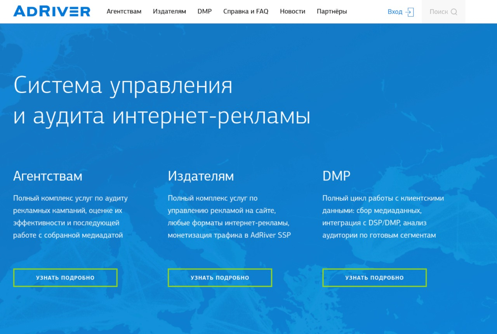
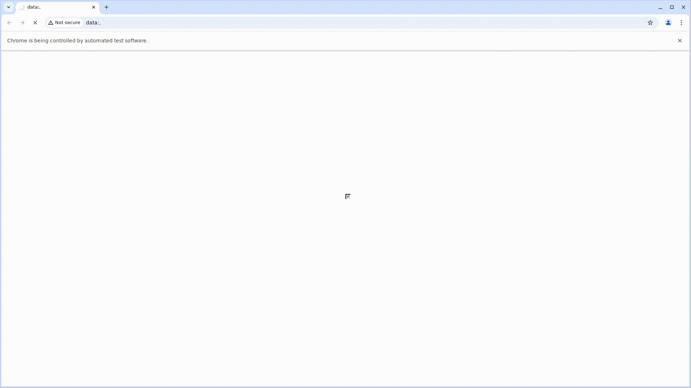
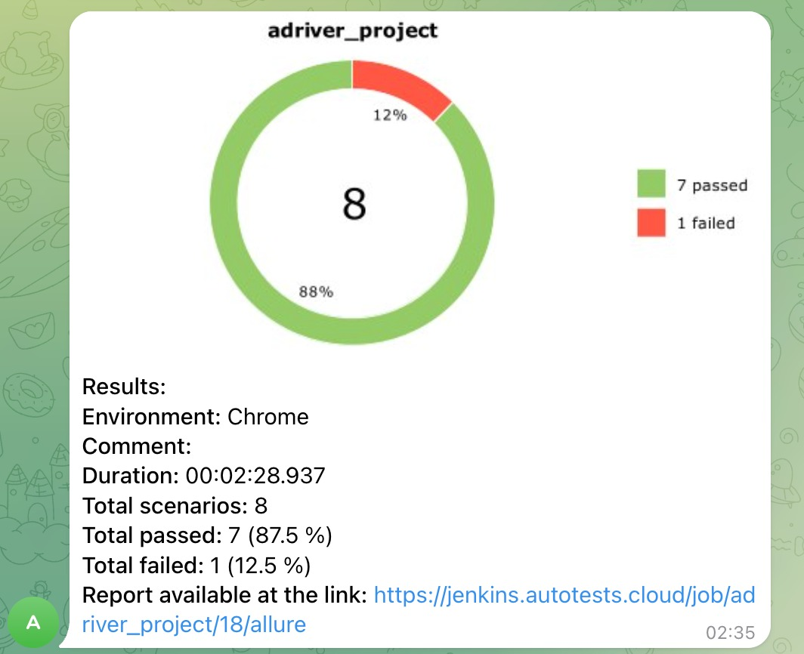
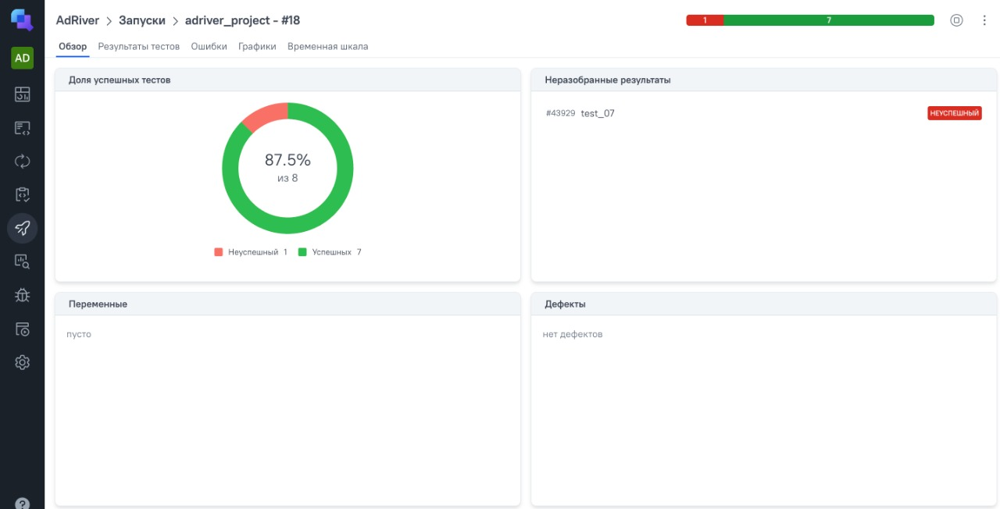
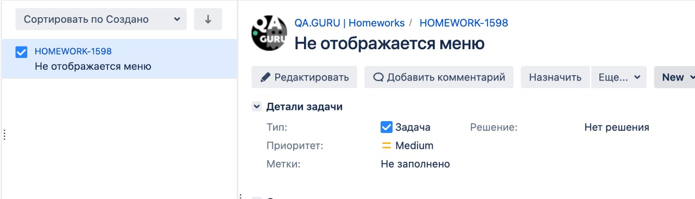

# Автоматизация тестирования [AdRiver](https://www.adriver.ru/)

## **Содержание:**

____

* <a href="#tools">Технологии и инструменты</a>
* <a href="#cases">Тест-кейсы</a>
* <a href="#console">Установка и запуск</a>
* <a href="#cicd">Запуск в CI/CD</a>
* <a href="#allure">Allure отчет</a>
* <a href="#telegram">Уведомление в Telegram</a>
* <a href="#allure-testops">Интеграция с Allure TestOps</a>
* <a href="#jira">Интеграция с Jira</a>

----
<a id="tools"></a>

## <a name="Технологии и инструменты">**Технологии и инструменты:**</a>

<p align="center">  
<a href="https://www.jetbrains.com/idea/"></a>  
<a href="https://https://web.telegram.org//"></a>  
<a href="https://aerokube.com/selenoid/"></a>  
<a href="ht[images](images)tps://github.com/allure-framework/allure2"></a> 
<a href="https://qameta.io/"></a>   
<a href="https://www.jenkins.io/"></a>  
<a href="https://selenoid.autotests.cloud/#/capabilities/"></a>  
</p>

<a id="cases"></a>

## <a name="Тест-кейсы">**Тест-кейсы:**</a>

____
| Тест | Описание | Severity |
|------|----------|----------|
| test_1 | Корректное открытие страницы | Critical |
| test_2 | Проверка кнопки "Login"| Critical |
| test_3 | Проверка поля ввода| Critical |
| test_4 | Проверка кнопки "Агенствам" | Normal |
| test_5 | Проверка видимости основных вкладок | Normal |
| test_6 | Скролл вниз и проверка кнопки "Политика конфиденциальности" | Normal |
| test_7 | Проверка интерактивных элементов страницы | Normal |
| test_8 | Проверка URL | Normal |

<a id="console"></a>

## Установка и запуск

### Установка зависимостей

```bash
pip install -r requirements.txt
```

### Запуск всех тестов
```bash
pytest
```

### Запуск конкретного теста

```bash
pytest tests/test_01.py 
```

### Просмотр Allure отчёта

```bash
allure serve allure-results
```
<a id="cicd"></a>

## Запуск в CI/CD

Тесты запускаются через **Jenkins** вручную.  
Браузер поднимается удалённо через **Selenoid** с включённой записью видео и VNC.

<a id="allure"></a>

## Allure отчёт

Каждый тест содержит следующие аттачменты:
- 📸 Скриншот
  
- 📄 Исходный код страницы
- 📋 Логи браузера
- 🎥 Запись видео выполнения теста
  

<a id="telegram"></a>

  ## Уведомления в Telegram

После завершения запуска в Jenkins автоматически отправляется уведомление в Telegram с результатами тестов.

Уведомление содержит:
- 📊 Диаграмму с результатами
- ✅ Количество успешных тестов
- ❌ Количество упавших тестов
- ⏱ Продолжительность запуска
- 🔗 Ссылку на Allure отчёт



<a id="allure-testops"></a>

## Интеграция с Allure TestOps

В Allure TestOps хранится тест-план с ручными и автоматизированными тестами.  
Результаты автозапусков из Jenkins автоматически отображаются в Allure TestOps.



<a id="jira"></a>

## Интеграция с Jira

Тест-кейсы и результаты запусков связаны с задачами в Jira.  
Из каждой задачи можно перейти к связанным тестам и результатам их выполнения.



